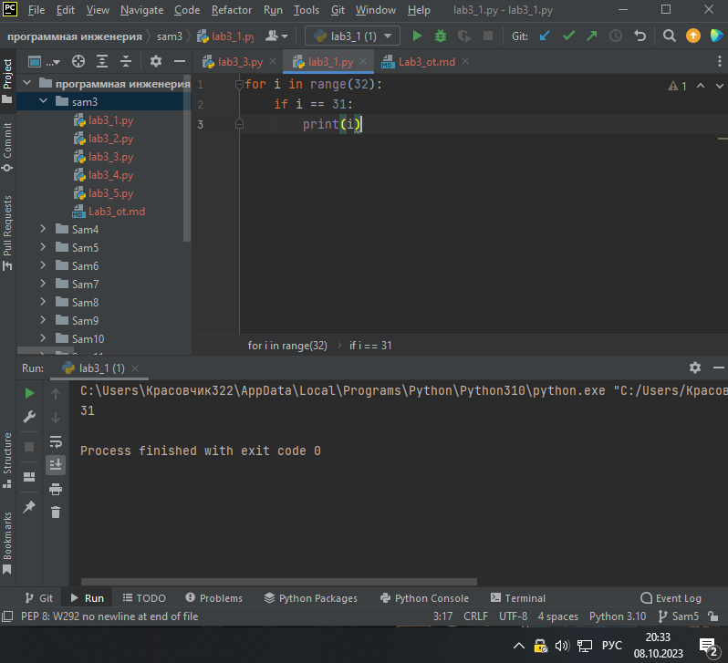
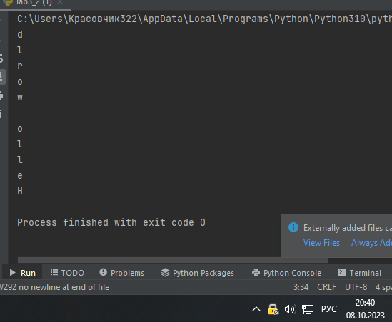
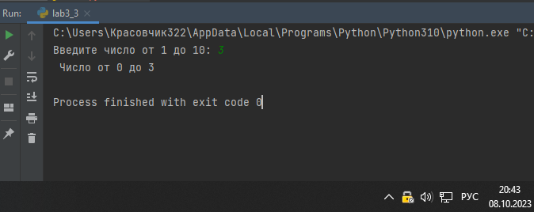
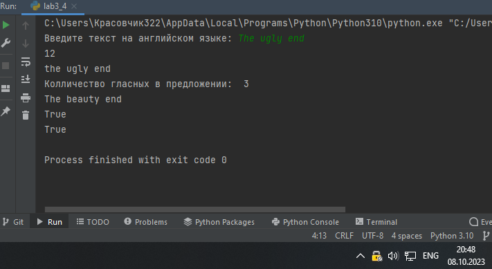
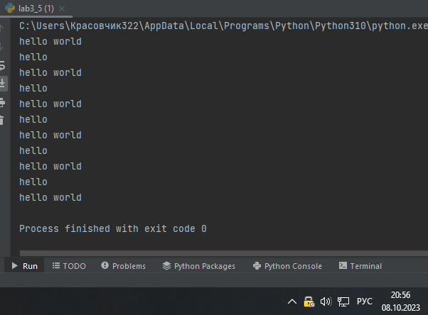

Самостоятельная работа 3

Прокопчук Виталий Сергеевич

ЗПИЭ 20-1

| Задание   | Лаб_раб | Сам_раб |
| ------------------ | --------------- | --------------- |
| Задание 1 | -             | +             |
| Задание 2 | -             | +             |
| Задание 3 | -             | +             |
| Задание 4 | -             | +             |
| Задание 5 | -             | +             |
|                  |               |               |
|                  |               |               |
|                  |               |               |
|                  |               |               |
|                  |               |               |

Работу проверили:

* к.э.н., доцент Панов М.А.

Задание 1

\1)	Напишите программу, которая преобразует 1 в 31\.

Для выполнения поставленной задачи необходимо обязательно и только один раз использовать:

•	Цикл for

•	\*= 5

•	+= 1

Никаких других действий или циклов использовать нельзя.

Решение 

Вывод. Изначально переменная “i” имеет значение 1, при помощи цикла и функции range мы даем ей значение 31.

Задание 2

\2)	Напишите программу, которая фразу «Hello World» выводит в обратном порядке, и каждая буква находится в одной строке консоли\. Пример вывода в консоль: При этом необходимо обязательно использовать любой цикл, а также программа должна занимать не более 3 строк в редакторе кода\.

Решение

text = "Hello world"
for i in range(len(text)):
``print(text[len(text) - i -1])

Вывод

Создаем переменную, узнаем длину строки и печатаем ее в обратном порядке.

Задание 3

\3)	Напишите программу, на вход которой поступает значение из консоли, оно должно быть числовым и в диапазоне от 0 до 10 включительно (это необходимо учесть в программе)\. Если вводимое число не подходит по требованиям, то необходимо вывести оповещение об этом в консоль и остановить программу\. Код должен вычислять в каком диапазоне находится полученное число\. Нужно учитывать три диапазона:

•	от 0 до 3 включительно

•	от 3 до 6

•	от 6 до 10 включительно

Результатом работы программы будет выведенный в консоль диапазон. Программа должна занимать не более 10 строчек в редакторе кода.

Решение

i = int(input("Введите число от 1 до 10: "))
if i <= 3 and i >= 0:
``print(" Число от 0 до 3") elif i >= 3 and i <= 6: ``print(" от 3 до 6")
elif i >= 6 and i <= 10:
``print("Число от 6 до 10") else: ``print("Введино не правильное число!")

Запрашиваем значение переменной у пользователя, с конвертацией ее в тип интенджер, запускаем проверки что бы определить в каком диапазоне введённое значение пользователя.

Задание 4

Манипулирование строками. Напишите программу на Python, которая принимает предложение (на английском) в качестве входных данных от пользователя. Выполните следующие операции и отобразите результаты:

•	Выведите длину предложения.

•	Переведите предложение в нижний регистр.

•	Подсчитайте количество гласных (a, e, i, o, u) в предложении.

•	Замените все слова "ugly" на "beauty".

•	Проверьте, начинается ли предложение с "The" и заканчивается ли на "end".

Проверьте работу программы минимум на 3 предложениях, чтобы охватить проверку всех поставленных условий.

Решение

text = input("Введите текст на английском языке: ")
print(len(text))

print(text.lower())

glas = set("aeiou")
count = 0
for i in text:
``if i in glas: ``count +=1
print("Колличество гласных в предложении: ", count)

text = text.replace("ugly", "beauty")
print(text)

print(text.startswith("The"))
print(text.endswith("end"))

Запрашиваем у пользователя текст. Считаем и выводим длину строки, печатаем строку в нижнем регистре, создаем переменную в которой будут храниться гласные буквы, создаем счетчик. Проходим циклом for in по переменной text и проверяем наличие гласных в нем, если они есть то увеличиваем значение счетчика на 1, печатаем результат. Используем функцию .replece что бы заменить нужные слова. При помощи функции .startswith проверяем начинается ли переменная с “The” и функции .endswith заканчивается ли переменная на “end”.

Задание 5

\5)	Составьте программу, результатом которой будет данный вывод в консоль:

Программу нужно составить из данных фрагментов кода:

Решение

string = "hello"
counter = 0
values = [0, 2, 4, 6, 8, 10]
while counter != 10:
``memory = string ``if counter in values:
``string = string + " world" ``print(string)
``counter +=1 ``string = memory
memory = " world"
print(string + memory)

Вывод

Создаем текстовую переменную “string”, счетчик “counter” и список “values”. Запускаем цикл while с условием пока “counter” не равен 10. Создаем новую переменную “memory” и присваиваем ей значение переменной “string”, создаем условие если “counter” имеет значение такое же как и элемент списка “values” то значение “string” = “string” + “world”, выводим переменную на печать и увеличиваем “counter” на +1, меняем значение “string” на “memory”. После окончания цикла присваиваем каждой переменной свое значение и печатаем их сумму.
